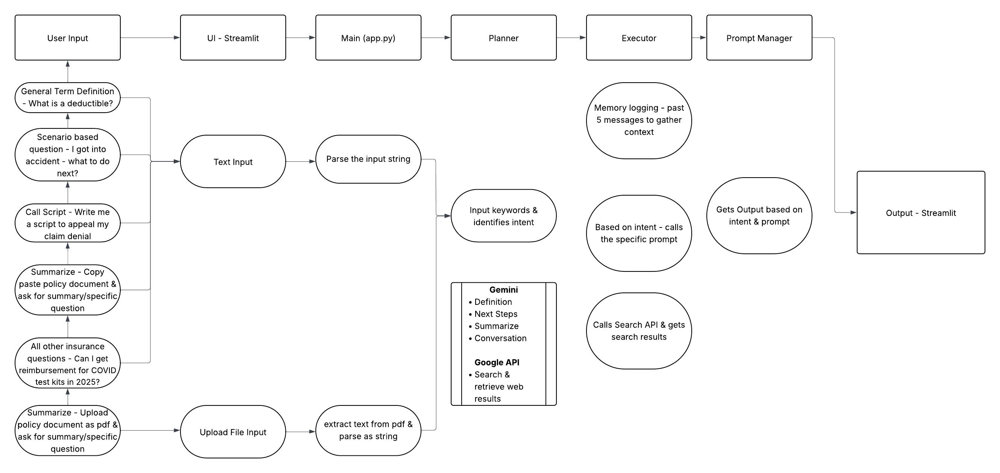

## 2. `ARCHITECTURE.md`

```markdown
# Architecture Overview

Below, sketch (ASCII, hand-drawn JPEG/PNG pasted in, or ASCII art) the high-level components of your agent.

## Components

1. **User Interface**  
   - Streamlit 

2. **Agent Core**
   - 
   - **Planner**:   
   - **Executor**: LLM prompt + tool-calling logic  
   - **Memory**: logs  

3. **Tools / APIs**  
   - Google Gemini API
   - Google Search API & Google CSE (Programmable search engine)


4. **Observability**  
   - Logging of each reasoning step upto 5 historic messages 
   - Error handling / retries
   - Handle vague search results

 

